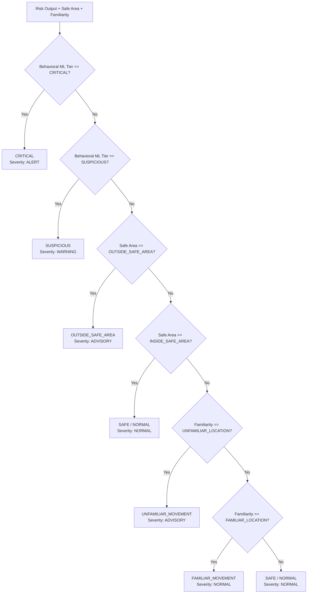

# Production Inference & Lifecycle Architecture Contract

This document specifies the finalized ML-side inference contract, lifecycle flows, deterministic interpretation layer, and CLI interfaces for the **Personalized Predictive Kinematic Risk Model**.

---

## 1. Core Architectural Concepts & Definitions

To maintain strict scientific integrity and avoid conflating distinct data sources or modeling layers, the architecture enforces clear operational definitions:

| Concept | Architectural Role | Source / Definition | Ground Truth Status |
| :--- | :--- | :--- | :--- |
| **Historical Data** | Establishes personal mobility profile | Historical trajectory folder or stored profile (`trip_count >= 7`) | Establishes statistical dispersion ($\tilde{x}, \text{MAD}, P_{95}$) and DBSCAN spatial anchors. Strictly isolated from current movement. |
| **Current Data** | Active movement evaluated for anomalies | Real-time telemetry payload (`TelemetryPayload`) or current 120s analysis window | Subject to kinematic feature extraction and forward-looking model scoring. |
| **Familiarity** | Proximity to routine locations | Algorithmic DBSCAN clustering on historical trajectory endpoints (`anchor_eps_m = 150.0m`, `anchor_min_samples = 3`, `anchor_confirmed_min_visits = 5`, `anchor_min_radius_m = 25.0m`, `anchor_radius_percentile = 95.0`) | Derived algorithmically. **Does NOT denote caregiver-confirmed safety or clinical truth.** |
| **Behavioral ML** | Predicts future kinematic excursions | Supervised native XGBoost Boosters evaluating 49 kinematic features | Predicts forward-looking boundary departure across locked horizons. |
| **Decision Layer** | Deterministic operational interpretation | Rule engine synthesizing Safe Area, Familiarity, and Behavioral Tier | **Deterministic contextual interpretation only. NOT a new trained model.** |

---

## 2. User Lifecycle Architecture

The inference engine strictly differentiates between cold-start evaluation and personalized adaptive evaluation:


### Flow A: New User (Cold Start)
1. **Input**: Current telemetry window is provided; historical trajectory data is absent (`trip_count < 7`).
2. **Baseline**: Evaluated zero-shot using the **Population Prior Baseline** (`population_baseline.json`) derived from the 146-user training cohort.
3. **Profile Mode**: Explicitly marked as `profile_mode="COLD_START"`.
4. **Geographic State**: Safe area evaluated if externally provided; familiarity defaults to `familiarity_state="NO_HISTORY"`.
5. **Progression**: Trajectories are accumulated until the user reaches the warm-up criterion ($\ge 7$ trips with $\ge 10$ evaluable windows), triggering automated profile compilation.

### Flow B: Existing User (Personalized Adaptation)
1. **Input**: Current telemetry window + stored user profile (or historical trajectory folder).
2. **Baseline**: Evaluated using the user's personal dispersion statistics ($\tilde{x}_i, \text{MAD}_i, P_{95, i}$) across 8 key kinematic dimensions.
3. **Profile Mode**: Explicitly marked as `profile_mode="PERSONALIZED"`.
4. **Familiarity**: Current coordinates are checked against the user's historical spatial anchors (DBSCAN clusters on trajectory endpoints with `anchor_eps_m = 150.0m`, `anchor_min_samples = 3`, `anchor_min_radius_m = 25.0m`, `anchor_radius_percentile = 95.0`).
5. **Strict Temporal Isolation**: Historical profile construction strictly excludes the current trajectory being evaluated to prevent future-data contamination.

---

## 3. Locked Prediction Horizons & Investigation of 300s

### Locked Behavioral ML Horizons
The predictive behavioral ML models operate strictly across four window-harmonic horizons:
- **120s (2m Micro)**: Immediate short-term kinematic instability
- **360s (6m Operational Short)**: Early-warning trajectory divergence
- **600s (10m Medium)**: Mid-range route-level departure risk
- **840s (14m Operational Extended)**: Long-range corridor breach excursion

Each horizon corresponds to a serialized native XGBoost Booster (`xgb_horizon_<h>s.json`) with validation-tuned optimal decision thresholds and Platt calibrators.

### Investigation of `horizon_sec=300`
An audit of all references to `300` across the repository confirms:
1. **Not a Supported Horizon**: `300s` is **NOT** a supported operational prediction horizon. Any call to `predict_window(..., horizon_sec=300)` is strictly rejected with a `ValueError("Unsupported horizon: 300s. Available: [120, 360, 600, 840]")`.
2. **Audit Counterexample Context**: In `ml/tests/test_risk.py` (lines 89–118), `horizon_sec=300` was used solely as a theoretical audit counterexample to verify that non-window-aligned boundary-crossing windows force `NaN` rather than leaking future labels.
3. **Preprocessing Gap Threshold**: In `ml/src/trajectory.py`, `300.0s` denotes the inactivity gap threshold (5 minutes) used to split disjoint trips.
4. **Profile Speed Cap**: In `ml/src/profile.py`, `300 m/s` (~1080 km/h) is the maximum velocity ceiling used to preserve commercial flight data from being discarded.
5. **Documentation Correction**: The illustrative example in Chunk 3 containing `horizon_sec=300` was purely hypothetical example text. All production documentation and contracts strictly reflect the canonical locked default horizon: **120s** (and all four horizons 120s, 360s, 600s, 840s).

---

## 4. Deterministic Decision Interpretation Layer

The decision layer (`ml/src/decision.py`) deterministically synthesizes the three dimensions into one of six canonical states:



### Truth Table & Precedence Rules

| Condition | Behavioral ML Tier | Safe-Area State | Familiarity State | Decision State | Severity Level | Methodological Justification |
| :--- | :--- | :--- | :--- | :--- | :--- | :--- |
| **1** | `CRITICAL` | *Any* | *Any* | `CRITICAL` | `ALERT` | **Behavioral Dominance**: Severe kinematic excursion overrides geographic status. Safe area or familiar anchor never masks acute anomaly. |
| **2** | `SUSPICIOUS` | *Any* | *Any* | `SUSPICIOUS` | `WARNING` | **Behavioral Dominance**: Elevated kinematic anomaly overrides geographic location. |
| **3** | Normal (`QUIESCENT` / `NORMAL_TRANSIT`) | `OUTSIDE_SAFE_AREA` | *Any* | `OUTSIDE_SAFE_AREA` | `ADVISORY` | **Location Alone Not Danger**: Outside safe boundary with normal kinematics is an advisory event, NEVER elevated to Suspicious or Critical. |
| **4** | Normal | `INSIDE_SAFE_AREA` | *Any* | `SAFE / NORMAL` | `NORMAL` | **Safe-Area Guarantee**: Normal movement inside configured safe boundary is guaranteed `SAFE / NORMAL`. |
| **5** | Normal | `SAFE_AREA_UNAVAILABLE` | `UNFAMILIAR_LOCATION` | `UNFAMILIAR_MOVEMENT` | `ADVISORY` | **Unfamiliar != Dangerous**: Movement in unobserved sector with normal kinematics is informational advisory only. |
| **6** | Normal | `SAFE_AREA_UNAVAILABLE` | `FAMILIAR_LOCATION` | `FAMILIAR_MOVEMENT` | `NORMAL` | Normal transit within catchment of historical spatial anchor. |
| **7** | Normal | `SAFE_AREA_UNAVAILABLE` | `NO_HISTORY` / `INSUFFICIENT_EVIDENCE` | `SAFE / NORMAL` | `NORMAL` | Normal baseline transit in zero-shot or cold-start setting. |

### Key Methodological Invariants
1. **Contextual Severity Only**: `OUTSIDE_SAFE_AREA` severity is contextual/application-facing only (`ADVISORY`), never modifying underlying XGBoost probabilities or elevating behavioral tiers.
2. **Algorithmic Familiarity**: Proximity to historical anchors is purely algorithmic (DBSCAN) and **does not represent caregiver-confirmed or clinical truth**.
3. **Model Orthogonality**: Decision interpretation does **NOT** modify or retrain the XGBoost models. Numerical risk scores, probabilities, and binary alert outputs remain bitwise invariant regardless of safe-area configuration.
4. **Raw Research Preservation**: All raw outputs (`risk_score`, `calibrated_probability`, `raw_probability`, `horizon_sec`, `binary_alert`, `top_features`, `max_mad_z_score`) remain fully exposed.
5. **No Fabricated Labels**: GeoLife trajectories do not contain ground-truth safe-area or clinical labels. Safe boundaries are strictly external inputs.
6. **Non-Clinical Notice**: Every decision output includes a mandatory non-clinical notice:
   > *Associational kinematic and geospatial decision output. Reflects mathematical outlier probabilities and configured geographic boundaries. Does NOT constitute clinical diagnosis, dementia evaluation, wandering detection, or ground-truth safety guarantees.*

---

## 5. Structured Output Contracts

### Top-Level Schema (`RiskScoreOutput` + `decision`)
Every prediction window produces the following standardized contract:

```json
{
  "user_id": "000",
  "timestamp": "2008-10-23T02:55:04Z",
  "risk_tier": "NORMAL_TRANSIT",
  "risk_score": 18.5,
  "polling_tier": 1,
  "predicted_lead_time_sec": null,
  "battery_override_active": false,
  "kinematic_features": {
    "mean_speed_mps": 1.25,
    "speed_std_dev": 0.20,
    "path_distance_m": 150.0,
    "straight_line_displacement_m": 140.0,
    "tortuosity_index": 1.12,
    "entropy_directional": 1.05,
    "turn_frequency": 0.02,
    "loop_metric": 0.01,
    "pacing_tendency": 0.0,
    "max_mad_z_score": 0.85,
    "behavioral_indicator": "NORMAL",
    "behavioral_confidence": 0.95
  },
  "trigger_state": {
    "window_seconds": 120,
    "horizon_sec": 120,
    "decision_threshold": 0.38,
    "calibrated_probability": 0.185,
    "raw_probability": 0.142,
    "binary_alert": false
  },
  "explainability": {
    "behavior_classification": "NORMAL",
    "top_features": [
      {"feature": "mean_speed_mps", "value": 1.25},
      {"feature": "tortuosity_index", "value": 1.12}
    ],
    "disclaimer": "Associational kinematic excursion prediction relative to learned baseline. Reflects mathematical outlier trajectory probability, NOT clinical dementia or wandering."
  },
  "safe_area_state": "OUTSIDE_SAFE_AREA",
  "familiarity_state": "FAMILIAR_LOCATION",
  "decision_state": "OUTSIDE_SAFE_AREA",
  "display_state": "OUTSIDE SAFE AREA (NORMAL KINEMATICS)",
  "human_readable_reason": "Position is 45.0m outside configured safe area 'Home Zone', but is near historical anchor 'u000_anchor_0'. Kinematic indicators remain within routine limits.",
  "decision": {
    "decision_state": "OUTSIDE_SAFE_AREA",
    "display_state": "OUTSIDE SAFE AREA (NORMAL KINEMATICS)",
    "headline": "Outside Configured Safe Area Boundary",
    "reason": "Position is 45.0m outside configured safe area 'Home Zone', but is near historical anchor 'u000_anchor_0'. Kinematic indicators remain within routine limits.",
    "severity_level": "ADVISORY",
    "profile_mode": "PERSONALIZED",
    "safe_area_state": "OUTSIDE_SAFE_AREA",
    "familiarity_state": "FAMILIAR_LOCATION",
    "behavioral_tier": "NORMAL_TRANSIT",
    "behavioral_pattern": "NORMAL",
    "risk_score": 18.5,
    "calibrated_probability": 0.185,
    "raw_probability": 0.142,
    "horizon_sec": 120,
    "binary_alert": false,
    "top_features": ["mean_speed_mps", "tortuosity_index"],
    "distance_to_safe_boundary_m": 45.0,
    "safe_area_name": "Home Zone",
    "nearest_anchor_id": "u000_anchor_0",
    "distance_to_nearest_anchor_m": 22.0,
    "is_caregiver_confirmed_anchor": false,
    "trip_count": 15,
    "disclaimer": "Associational kinematic and geospatial decision output. Reflects mathematical outlier probabilities and configured geographic boundaries. Does NOT constitute clinical diagnosis, dementia evaluation, wandering detection, or ground-truth safety guarantees."
  }
}
```

---

## 6. Manual Inference CLI Usage

The manual inference interface (`ml/src/manual_inference.py`) allows offline validation without modifying frozen models or running pipeline re-training:

### 1. New User (Zero-Shot / Cold-Start Evaluation)
```bash
py -m ml.src.manual_inference \
  --input "ml/data/raw/geolife/000/Trajectory/20081023025304.plt" \
  --horizon 120
```

### 2. Existing User (Personalized Evaluation with Historical Trajectories)
```bash
py -m ml.src.manual_inference \
  --input "ml/data/raw/geolife/000/Trajectory/20081024020959.plt" \
  --history "ml/data/raw/geolife/000/Trajectory" \
  --horizon 120
```

### 3. Multi-Horizon Comprehensive Evaluation (120s, 360s, 600s, 840s)
```bash
py -m ml.src.manual_inference \
  --input "ml/data/raw/geolife/000/Trajectory/20081023025304.plt" \
  --horizon all
```

### 4. Evaluating with Configured Safe Area
```bash
# Circular safe area: lat,lon,radius_meters
py -m ml.src.manual_inference \
  --input "ml/data/raw/geolife/000/Trajectory/20081023025304.plt" \
  --safe-area "39.9840,116.3180,500" \
  --horizon 120
```

---

## 7. Verification Test Suite Summary

The entire inference contract and architecture are validated by automated unit tests:

| Test Suite | Focus | Tests | Status |
| :--- | :--- | :--- | :--- |
| [`ml/tests/test_inference_contract.py`](file:///c:/Projects/mobility-guardian/ml/tests/test_inference_contract.py) | Locked horizons, 300s rejection, lifecycle flows, behavioral dominance, decision layer orthogonality | 11 | **ALL PASS** |
| [`ml/tests/test_decision.py`](file:///c:/Projects/mobility-guardian/ml/tests/test_decision.py) | Deterministic decision interpretation truth table and 6 states | 10 | **ALL PASS** |
| [`ml/tests/test_geospatial.py`](file:///c:/Projects/mobility-guardian/ml/tests/test_geospatial.py) | Safe-area evaluation, DBSCAN spatial anchor familiarity | 17 | **ALL PASS** |
| [`ml/tests/test_profile_flow.py`](file:///c:/Projects/mobility-guardian/ml/tests/test_profile_flow.py) | Cold-start transitions, historical profile builder, temporal isolation | 6 | **ALL PASS** |
| [`ml/tests/test_profile_anchors.py`](file:///c:/Projects/mobility-guardian/ml/tests/test_profile_anchors.py) | Anchor persistence, DBSCAN clustering parameters, profile reload | 10 | **ALL PASS** |
| **Complete ML Suite** | All 14 test modules across `ml/tests/` | **170** | **ALL PASS** |
